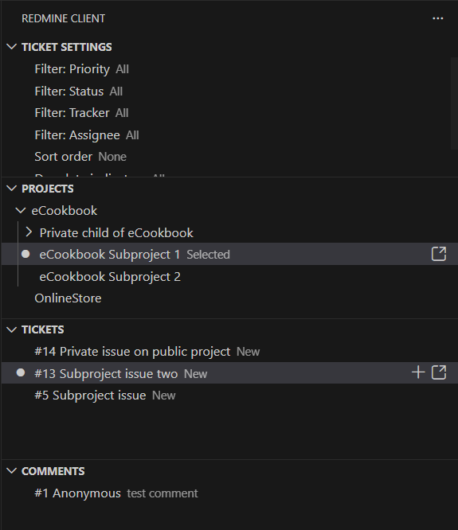

# Redmine Client

Redmine Client brings Redmine 6.1 ticket workflows into VS Code. Browse projects, triage tickets, preview details, create new issues from your editor content, manage comments, and sync changes — without leaving the editor.

Japanese README: `README.ja.md`

## Highlights

- Dedicated Activity Bar views: Ticket Settings / Open Editors / Projects / Tickets / Comments
- Fast ticket browsing with status, priority, tracker, assignee, and title filters
- One-click ticket and comment preview in the editor
- Create tickets from the active editor or from the ticket list (including child tickets)
- Sync button in the editor title bar (`Redmine: Sync to Redmine`) for explicit save
- Status bar shows the current ticket ID while a ticket editor is focused
- **Automatic image upload**: paste images in Markdown editors and they are uploaded on save
- Mermaid blocks converted to redmica_ui_extension format (`{{mermaid ... }}`)
- Edit only your own comments safely
- **Conflict detection with diff view**: detect remote changes before saving and resolve via diff editor
- **Offline sync mode**: queue ticket/comment saves and manually upload later
- **Draft persistence**: ticket and comment drafts survive VS Code restarts
- Open tickets/comments in a browser from the tree view context menu

## Requirements

- Redmine 6.1 server
- Redmine API key with access to target projects

## Quick Start

1. Set `redmine-client.baseUrl` and `redmine-client.apiKey` in VS Code settings.
2. Set `redmine-client.defaultProjectId` or pick a project from the **Projects** view.
3. Open the **Projects** view in the Activity Bar and select a project.
4. Browse tickets in the **Tickets** view and click to open an editor.
5. Edit and save — changes are synced automatically (or queued in manual offline mode).

## Activity Bar Views

| View | Description |
|------|-------------|
| **Ticket Settings** | Configure filters, sort, due-date display, editor defaults, and offline sync mode |
| **Open Editors** | List all currently open ticket and comment editors; click to focus |
| **Projects** | Select the active project; manual offline sync icon appears when queued |
| **Tickets** | Browse and filter project tickets; search, collapse, and create new tickets |
| **Comments** | View and edit your own comments for the selected ticket |



## Extension Settings

| Setting | Default | Description |
|---------|---------|-------------|
| `redmine-client.baseUrl` | `""` | Base URL of the Redmine instance (include `http://` or `https://`) |
| `redmine-client.apiKey` | `""` | Redmine API key for authentication |
| `redmine-client.ignoreSSLErrors` | `false` | Ignore SSL certificate errors (e.g. self-signed certificates) |
| `redmine-client.defaultProjectId` | `""` | Default project identifier or ID |
| `redmine-client.includeChildProjects` | `false` | Include child projects when listing tickets |
| `redmine-client.ticketListLimit` | `50` | Number of tickets loaded per request |
| `redmine-client.editorStorageDirectory` | `""` | Absolute path for storing editor files (empty = workspace default) |
| `redmine-client.offlineSyncMode` | `"auto"` | Save mode: `auto` syncs immediately, `manual` queues for offline sync |

## Ticket List Settings

Customize the Ticket list from the **Ticket Settings** view or via commands.

### Filters

- **Title**: Filter by keyword in the ticket subject
- **Status**: Show only tickets with specific statuses
- **Priority**: Show only tickets with specific priorities
- **Tracker**: Show only tickets with specific trackers
- **Assignee**: Show only tickets assigned to specific users

### Sorting

- **Sort**: Sort by priority, status, due date, etc.
- **Due Date Display**: Show due dates in the ticket list

### Relevant Ticket Filter

The `Redmine: 絞り込み表示切替` (filter icon in the Tickets view title bar) toggles a view that shows only tickets related to the currently open editors.

### Editor Defaults

Set default values applied when creating a new ticket:

- **Subject**, **Description**, **Tracker**, **Priority**, **Status**, **Due date**

## Commands

### View Commands

| Command | Description |
|---------|-------------|
| `Redmine: Refresh Projects` | Reload the project list |
| `Redmine: Refresh Tickets` | Reload the ticket list |
| `Redmine: Refresh Comments` | Reload the comment list |
| `Redmine: Reload Project` | Reload the selected project |
| `Redmine: Reload Ticket` | Reload the active ticket editor from Redmine |
| `Redmine: Reload Comment` | Reload the active comment editor from Redmine |
| `Redmine: Collapse All Projects` | Collapse all project tree nodes |
| `Redmine: Collapse All Tickets` | Collapse all ticket tree nodes |
| `Redmine: Select Project` | Enter a project ID to switch the active project |
| `Redmine: Toggle Child Projects` | Include/exclude child projects in the ticket list |
| `Redmine: Search Tickets` | Search tickets by keyword |
| `Redmine: 絞り込み表示切替` | Toggle relevant-tickets filter |

### Ticket Commands

| Command | Description |
|---------|-------------|
| `Redmine: Open Ticket Preview` | Open a read-only ticket preview in the editor |
| `Redmine: Open Ticket Editor (New)` | Open an additional editable ticket editor |
| `Redmine: Create Ticket from Editor` | Create a new ticket from the active editor content |
| `Redmine: New Ticket` | Open a blank new-ticket editor for the selected project |
| `Redmine: Add Child Ticket` | Create a child ticket under the selected ticket |
| `Redmine: Sync to Redmine` | Explicitly sync the active ticket/comment editor to Redmine |
| `Redmine: Focus Active Ticket in Tree` | Reveal the active ticket editor's ticket in the Tickets tree |
| `Redmine: Focus Open Ticket Editor` | Focus the open editor for the selected ticket |

### Comment Commands

| Command | Description |
|---------|-------------|
| `Redmine: Edit Comment` | Open the selected comment in the editor |
| `Redmine: Add Comment` | Add a new comment to the selected ticket |

### Browser Commands

| Command | Description |
|---------|-------------|
| `Redmine: Open Project in Browser` | Open the selected project in a browser |
| `Redmine: Open Ticket in Browser` | Open the selected ticket in a browser |
| `Redmine: Open Comment in Browser` | Open the selected comment in a browser |

### Ticket Settings Commands

| Command | Description |
|---------|-------------|
| `Redmine: Configure Ticket Title Filter` | Filter tickets by keyword in the subject |
| `Redmine: Configure Ticket Priority Filter` | Filter by priority |
| `Redmine: Configure Ticket Status Filter` | Filter by status |
| `Redmine: Configure Ticket Tracker Filter` | Filter by tracker |
| `Redmine: Configure Ticket Assignee Filter` | Filter by assignee |
| `Redmine: Configure Ticket Sort` | Set the sort order |
| `Redmine: Configure Ticket Due Date Display` | Configure due-date display rules |
| `Redmine: Reset Ticket Settings` | Reset all ticket list settings to defaults |

### Editor Default Commands

| Command | Description |
|---------|-------------|
| `Redmine: Configure Editor Default Subject` | Set the default subject for new tickets |
| `Redmine: Configure Editor Default Description` | Set the default description |
| `Redmine: Configure Editor Default Tracker` | Set the default tracker |
| `Redmine: Configure Editor Default Priority` | Set the default priority |
| `Redmine: Configure Editor Default Status` | Set the default status |
| `Redmine: Configure Editor Default Due Date` | Set the default due date |
| `Redmine: Reset Editor Defaults` | Clear all editor default values |

### Offline Sync Commands

| Command | Description |
|---------|-------------|
| `Redmine: Run Offline Sync` | Upload all queued offline saves |
| `Redmine: Configure Offline Sync Mode` | Switch between `auto` and `manual` sync |

## Tips

- **Sync button**: the `$(cloud-upload)` icon in the editor title bar runs `Redmine: Sync to Redmine` — useful when auto-save is on.
- **Draft persistence**: ticket/comment drafts are saved in VS Code global state and survive restarts.
- **Image paste**: paste images directly into a file-based editor; they are uploaded on save. Untitled editors require a first save before pasting.
- **Conflict resolution**: when remote changes are detected, choose **Local Priority**, **Remote Priority**, or **View Diff**.
- **Offline sync**: set mode to `manual` to queue saves, then upload with `Redmine: Run Offline Sync` or the Projects view title icon.
- **Mermaid**: blocks are converted to `{{mermaid ... }}` on submission to Redmine.
- **Browser links**: right-click any project, ticket, or comment in the tree for an "Open in Browser" option.
- **Status bar**: the current ticket ID is shown in the status bar when a ticket editor is active.

## Debug

1. Open this repo in VS Code.
2. Run the **Run Extension** debug configuration (F5).
3. Configure extension settings in the Extension Host window.
4. Verify behavior using the commands above.

## Tests

```bash
pnpm test              # compile + lint + VS Code integration tests
pnpm run test:unsafe   # no-sandbox variant for restricted environments
```

## Known Issues

- Clipboard attachments require a data URI format.
- Image paste is only available in file-based editors. For new ticket/comment drafts (untitled editors), save the file first.

## License

MIT
