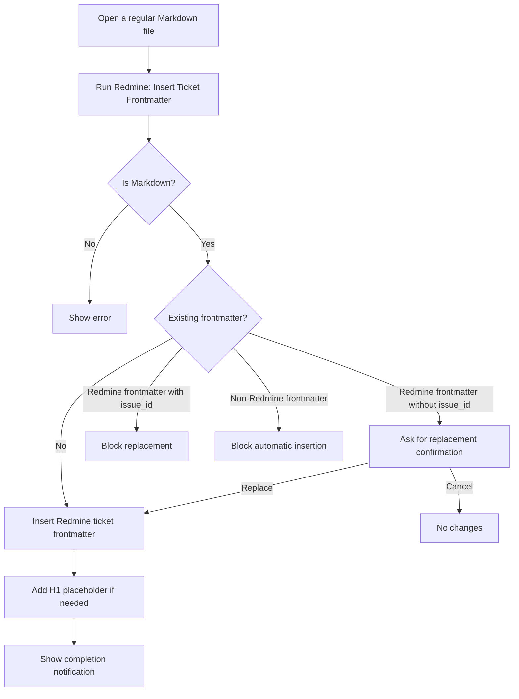

# Change Specification: Add Command to Insert Redmine Ticket Frontmatter

## 1. Purpose

Add a new explicit VS Code command that inserts a Redmine ticket frontmatter template into a regular Markdown file.

This command prepares a Markdown file for later Redmine ticket creation through a separate command, such as:

```text
Redmine: Create Ticket from Markdown Header
```

This command must **not** create a Redmine ticket. Its only responsibility is to insert or regenerate Redmine-specific ticket frontmatter safely.

---

## 2. Feature Summary

### Feature Name

```text
Insert Redmine Ticket Frontmatter
```

### Command ID

```text
redmine-client.insertRedmineTicketFrontmatter
```

### Command Palette Title

```text
Redmine: Insert Ticket Frontmatter
```

### Japanese Title

```text
Redmine: チケット用Frontmatterを挿入
```

---

## 3. Design Intent

The feature supports a two-step workflow:

1. Insert Redmine ticket frontmatter into a regular Markdown file.
2. Edit the subject, body, and metadata.
3. Run a separate command to create the Redmine ticket.

This separation is intentional.

| Command | Responsibility |
|---|---|
| `redmine-client.insertRedmineTicketFrontmatter` | Insert Redmine ticket metadata into Markdown |
| `redmine-client.createTicketFromMarkdownHeader` | Create a Redmine ticket from the Markdown header |

This avoids accidental Redmine ticket creation while still reducing manual frontmatter writing errors.

---

## 4. Scope

### 4.1 In Scope

| Area | Description |
|---|---|
| Regular Markdown files | Any `.md` file or editor with `languageId === "markdown"` |
| Frontmatter insertion | Insert Redmine ticket frontmatter at the beginning of the file |
| Empty Markdown files | Insert full frontmatter and an H1 subject placeholder |
| Existing H1 preservation | Keep the first H1 heading as the ticket subject |
| Existing body preservation | Preserve existing Markdown body content |
| Existing Redmine frontmatter handling | Allow replacement only after explicit confirmation |
| Duplicate-ticket protection | Never reset a file with `issue_id` back to `mode: new-ticket` |
| General frontmatter protection | Do not overwrite non-Redmine frontmatter |
| Localization | Add English and Japanese l10n entries |
| Tests | Add unit and command-level tests |

### 4.2 Out of Scope

| Area | Reason |
|---|---|
| Redmine ticket creation | Handled by a separate command |
| Automatic insertion on file save | Too intrusive and error-prone |
| Explorer context menu | Future enhancement |
| Bulk insertion into multiple files | Out of MVP scope |
| Merging with arbitrary YAML frontmatter | Requires YAML AST-level editing |
| Preserving YAML comments | Out of MVP scope |
| Redmine tracker/priority/status QuickPick | Future enhancement |
| Existing ticket update | Not part of this command |

---

## 5. User Workflow



---

## 6. Inserted Template

### 6.1 Standard Template

```markdown
---
mode: new-ticket
project_id: 123
issue:
  tracker:   Task
  priority:  Normal
  status:    New
  assignee:
  assignee_id:
  start_date:
  due_date:
---

# Ticket subject

```

---

## 7. Initial Value Resolution

| Field | Initial Value |
|---|---|
| `project_id` | Selected project ID → `redmine-client.defaultProjectId` → empty |
| `tracker` | Editor default tracker → `Task` |
| `priority` | Editor default priority → `Normal` |
| `status` | Editor default status → `New` |
| `assignee` | Empty |
| `assignee_id` | Empty |
| `start_date` | Empty |
| `due_date` | Empty |
| `subject` | Existing first H1 → `Ticket subject` |
| `body` | Preserve existing body |

### Notes

- If no project ID can be resolved, insert `project_id:` with an empty value.
- Do not block insertion only because `project_id` is empty.
- The later ticket creation command is responsible for requiring a valid project ID.

---

## 8. Markdown Transformation Rules

## 8.1 Empty File

### Before

```markdown

```

### After

```markdown
---
mode: new-ticket
project_id: 123
issue:
  tracker:   Task
  priority:  Normal
  status:    New
  assignee:
  assignee_id:
  start_date:
  due_date:
---

# Ticket subject

```

---

## 8.2 File with Existing H1

### Before

```markdown
# Investigate API Timeout

The API response is delayed through the OpenResty route.
```

### After

```markdown
---
mode: new-ticket
project_id: 123
issue:
  tracker:   Task
  priority:  Normal
  status:    New
  assignee:
  assignee_id:
  start_date:
  due_date:
---

# Investigate API Timeout

The API response is delayed through the OpenResty route.
```

### Rule

The existing first H1 heading must be preserved and used as the ticket subject.

---

## 8.3 File Without H1

### Before

```markdown
The API response is delayed through the OpenResty route.
Database wait time is suspected.
```

### After

```markdown
---
mode: new-ticket
project_id: 123
issue:
  tracker:   Task
  priority:  Normal
  status:    New
  assignee:
  assignee_id:
  start_date:
  due_date:
---

# Ticket subject

The API response is delayed through the OpenResty route.
Database wait time is suspected.
```

### Rule

If no H1 heading exists, add a default H1 placeholder before the original body.

---

## 9. Existing Frontmatter Detection

## 9.1 Redmine Frontmatter

A frontmatter block is considered Redmine-related if it contains any of the following:

```yaml
mode: new-ticket
```

```yaml
mode: ticket-update
```

```yaml
issue:
```

```yaml
issue_id:
```

---

## 9.2 Non-Redmine Frontmatter

Example:

```markdown
---
title: Meeting Note
tags:
  - redmine
---

# Memo
```

This must be treated as non-Redmine frontmatter.

### Behavior

Do not insert or overwrite automatically.

### Message

```text
This file already has non-Redmine frontmatter. Insert Redmine frontmatter manually to avoid overwriting existing metadata.
```

### Rationale

General Markdown tools such as Obsidian, Hugo, Docusaurus, or other static site generators may rely on frontmatter. Overwriting it could destroy user metadata.

---

## 10. Replacement Rules

| File State | Behavior |
|---|---|
| No frontmatter | Insert Redmine ticket frontmatter |
| Redmine frontmatter exists and has no `issue_id` | Ask for replacement confirmation |
| Redmine frontmatter exists and has `issue_id` | Block replacement |
| Non-Redmine frontmatter exists | Block automatic insertion |
| Empty file | Insert full template |

---

## 11. Replacement Confirmation

When Redmine frontmatter already exists and no `issue_id` is present, show a confirmation dialog.

### Message

```text
Replace existing Redmine ticket frontmatter?
```

### Buttons

| Button | Behavior |
|---|---|
| `Replace` | Regenerate Redmine ticket frontmatter |
| `Cancel` | Keep the file unchanged |

---

## 12. `issue_id` Protection

If the file contains `issue_id`, the command must not replace the frontmatter.

### Example

```markdown
---
mode: ticket-update
project_id: 123
issue_id: 456
issue:
  tracker:   Task
  priority:  Normal
  status:    New
  due_date:
---

# Existing ticket
```

### Message

```text
This file is already linked to Redmine ticket #456.
```

### Rationale

Changing this file back to `mode: new-ticket` could cause duplicate Redmine ticket creation when the later ticket creation command is executed.

---

## 13. Implementation Plan

## 13.1 New Command File

```text
src/commands/insertRedmineTicketFrontmatter.ts
```

### Responsibilities

- Get the active editor.
- Validate that the current file is Markdown.
- Resolve default values.
- Call the frontmatter template service.
- Show replacement confirmation when required.
- Apply the updated document content.
- Show success or error notifications.

### Important Rule

This command file should remain thin. It should delegate transformation logic to a service module.

---

## 13.2 New Service File

```text
src/views/redmineTicketFrontmatterTemplate.ts
```

### Responsibilities

- Detect whether frontmatter exists.
- Detect Redmine frontmatter.
- Detect non-Redmine frontmatter.
- Detect existing `issue_id`.
- Detect the first H1 heading.
- Preserve existing Markdown body.
- Generate Redmine ticket frontmatter.
- Produce the updated Markdown content.
- Return structured outcomes for the command layer.

---

## 13.3 Suggested Service API

```ts
export type InsertFrontmatterResult =
  | {
      status: "inserted";
      content: string;
    }
  | {
      status: "replaceRequired";
      content: string;
      message: string;
    }
  | {
      status: "blocked";
      message: string;
    }
  | {
      status: "noChange";
      message: string;
    };

export const buildRedmineTicketFrontmatterContent = (input: {
  content: string;
  projectId?: number;
  tracker?: string;
  priority?: string;
  status?: string;
}): InsertFrontmatterResult;
```

The exact type shape may be adjusted during implementation, but the service should be testable without VS Code UI dependencies.

---

## 14. Package Manifest Changes

### 14.1 `activationEvents`

Add:

```json
"onCommand:redmine-client.insertRedmineTicketFrontmatter"
```

### 14.2 `contributes.commands`

Add:

```json
{
  "command": "redmine-client.insertRedmineTicketFrontmatter",
  "title": "%command.insertRedmineTicketFrontmatter.title%",
  "icon": "$(symbol-keyword)"
}
```

---

## 15. Command Registry Changes

### File

```text
src/app/commandRegistry.ts
```

### Import

```ts
import { insertRedmineTicketFrontmatter } from "../commands/insertRedmineTicketFrontmatter";
```

### Registration

```ts
vscode.commands.registerCommand(
  "redmine-client.insertRedmineTicketFrontmatter",
  async () => {
    await insertRedmineTicketFrontmatter();
  },
)
```

---

## 16. Localization

## 16.1 English: `l10n/bundle.l10n.json`

Add:

```json
{
  "command.insertRedmineTicketFrontmatter.title": "Redmine: Insert Ticket Frontmatter",
  "Open a Markdown file before inserting Redmine ticket frontmatter.": "Open a Markdown file before inserting Redmine ticket frontmatter.",
  "Redmine ticket frontmatter inserted.": "Redmine ticket frontmatter inserted.",
  "This file already has Redmine ticket frontmatter.": "This file already has Redmine ticket frontmatter.",
  "This file is already linked to Redmine ticket #{0}.": "This file is already linked to Redmine ticket #{0}.",
  "This file already has non-Redmine frontmatter. Insert Redmine frontmatter manually to avoid overwriting existing metadata.": "This file already has non-Redmine frontmatter. Insert Redmine frontmatter manually to avoid overwriting existing metadata.",
  "Replace existing Redmine ticket frontmatter?": "Replace existing Redmine ticket frontmatter?",
  "Replace": "Replace"
}
```

---

## 16.2 Japanese: `l10n/bundle.l10n.ja.json`

Add:

```json
{
  "command.insertRedmineTicketFrontmatter.title": "Redmine: チケット用Frontmatterを挿入",
  "Open a Markdown file before inserting Redmine ticket frontmatter.": "Redmineチケット用Frontmatterを挿入するMarkdownファイルを開いてください。",
  "Redmine ticket frontmatter inserted.": "Redmineチケット用Frontmatterを挿入しました。",
  "This file already has Redmine ticket frontmatter.": "このファイルには既にRedmineチケット用Frontmatterがあります。",
  "This file is already linked to Redmine ticket #{0}.": "このファイルは既にRedmineチケット #{0} に紐づいています。",
  "This file already has non-Redmine frontmatter. Insert Redmine frontmatter manually to avoid overwriting existing metadata.": "このファイルにはRedmine用ではないFrontmatterがあります。既存メタデータの破壊を避けるため、自動挿入は行いません。",
  "Replace existing Redmine ticket frontmatter?": "既存のRedmineチケット用Frontmatterを置き換えますか？",
  "Replace": "置換"
}
```

---

## 17. Test Specification

## 17.1 Normal Cases

| No. | Test | Expected Result |
|---:|---|---|
| 1 | Insert into empty Markdown file | Frontmatter and H1 placeholder are added |
| 2 | Insert into Markdown with existing H1 | H1 is preserved and frontmatter is inserted above it |
| 3 | Insert into Markdown with body content | Body content is preserved |
| 4 | Selected project ID exists | `project_id` is set to selected project ID |
| 5 | Default project ID exists | `project_id` is set to default project ID |
| 6 | No project ID exists | `project_id:` is inserted with an empty value |
| 7 | Existing Redmine frontmatter without `issue_id` | Replacement confirmation is shown |
| 8 | User chooses `Replace` | Redmine frontmatter is regenerated |
| 9 | User chooses `Cancel` | File remains unchanged |

---

## 17.2 Protection and Error Cases

| No. | Test | Expected Result |
|---:|---|---|
| 1 | No active editor | Error notification |
| 2 | Non-Markdown file | Error notification |
| 3 | Existing `issue_id` | Replacement is blocked |
| 4 | Non-Redmine frontmatter exists | Automatic insertion is blocked |
| 5 | Existing Redmine frontmatter and user cancels | File remains unchanged |
| 6 | Document edit fails | Error notification |
| 7 | Existing body content | Body is not lost |
| 8 | Multiple H1 headings | First H1 is treated as subject; structure remains preserved |

---

## 18. Acceptance Criteria

The implementation is complete when all of the following are true:

- A regular Markdown file can receive Redmine ticket frontmatter through the command.
- An empty Markdown file receives a full template.
- Existing first H1 heading is preserved.
- Existing body content is preserved.
- Existing Redmine frontmatter is not overwritten without confirmation.
- A file with `issue_id` is not reset to `mode: new-ticket`.
- Non-Redmine frontmatter is not overwritten automatically.
- The command does not create a Redmine ticket.
- The resulting Markdown can be used by the later `createTicketFromMarkdownHeader` command.
- Existing ticket editing and save-sync flows are not affected.

---

## 19. Implementation Order

1. Add `src/views/redmineTicketFrontmatterTemplate.ts`.
2. Add unit tests for frontmatter detection and content transformation.
3. Add `src/commands/insertRedmineTicketFrontmatter.ts`.
4. Add command registration to `src/app/commandRegistry.ts`.
5. Add `activationEvents` and `contributes.commands` entries to `package.json`.
6. Add English and Japanese l10n entries.
7. Add command-level tests.
8. Run the existing test suite and confirm no regression.

---

## 20. Risks and Mitigations

| Risk | Impact | Mitigation |
|---|---|---|
| User metadata loss | High | Block non-Redmine frontmatter |
| Duplicate ticket creation | High | Do not overwrite files with `issue_id` |
| User confusion with ticket creation | Medium | Make this command insertion-only |
| Existing Markdown body corruption | High | Add tests for H1 and body preservation |
| Service tied to VS Code UI | Medium | Keep transformation logic in a testable service |
| Future YAML merge complexity | Medium | Keep MVP strict and defer arbitrary YAML preservation |

---

## 21. Final Recommendation

Implement this as a strict insertion-only command.

The recommended command name is:

```text
redmine-client.insertRedmineTicketFrontmatter
```

The command palette title should be:

```text
Redmine: Insert Ticket Frontmatter
```

Do not use the word `formatter` in the command name. The feature does not format Markdown; it inserts Redmine-specific frontmatter. The clearer name reduces ambiguity and keeps responsibility narrow.

The recommended workflow is:

```text
Redmine: Insert Ticket Frontmatter
```

then edit the Markdown content, then run:

```text
Redmine: Create Ticket from Markdown Header
```

This two-step design provides the best balance of safety, usability, and implementation simplicity.
