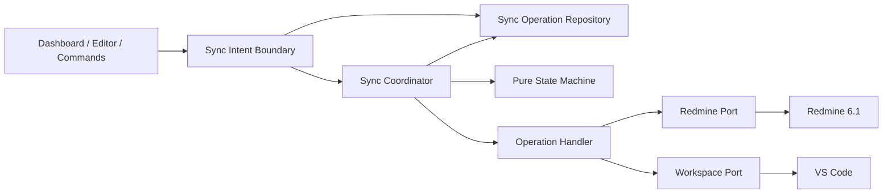

# vs-redmine-client 同期アーキテクチャ統合・変更仕様書

> 対象: `tiohsa/vs-redmine-client`
> 基準: `main` / `06c8ab03958bb9a447ef48e19990c01c3faa4da5`
> 作成基準日: 2026-08-13
> 本仕様は、添付の非局所的変更仕様生成プロンプトを実行し、添付HTMLの現行アーキテクチャ図を AS-IS の概念図として参照して作成する。  

---

# 1. 目的

## 1.1 解決する問題

`vs-redmine-client` の同期処理は、ネットワーク切断、VS Code 再起動、競合、remote commit 後の read-back failure、local finalize failure、子チケットの部分成功などを安全に扱うため、すでに高度な耐障害処理を持つ。

問題はこれらの機能自体ではない。

**同じ Durable Sync の状態・契約・復旧規則が複数箇所で独自に判断・実装されており、「すべての Redmine write が必ず同じ状態機械を通る」という構造的保証が成立していないこと**を根本原因とする。

現行コードでは、少なくとも以下が確認できる。

* Ticket / NewTicket は主に `TicketSyncService`
* Comment は `SyncEngine`
* Ctrl+S は `saveSyncExecutor`
* 明示同期は `syncToRedmine`
* Unsynced は `syncUnsyncedFile` / `offlineSync`
* Recovery UI は `syncUnsyncedFile`
* 永続状態・migration・state transition は `offlineSyncStore`
* 子チケット Saga は Ticket 固有処理内
* `createTicketFromEditor()` は durable sync 境界を通らず直接 `createIssue()` を呼ぶ

という複数経路になっている。

## 1.2 なぜ局所修正では不十分か

例えば、

* Ctrl+S の auto mode だけ直す
* `createTicketFromEditor` だけ `TicketSyncService` に接続する
* Comment だけ Ticket と同じ phase にする

という修正では、次に新しい write entry point が追加されたときに再び独自経路を作れる。

したがって変更後は、

> **Redmine に対する durable mutation は、入口や対象種別を問わず、1つの同期 Application Boundary と1つの状態遷移規則を必ず通る**

ことを構造とテストの双方で保証する。

## 1.3 変更後に成立させる状態

```text
Dashboard
Markdown Editor / Ctrl+S
Command Palette
Unsynced
Recovery
        │
        ▼
   Sync Intent Boundary
        │
        ▼
Persistent SyncOperation
        │
        ▼
   Sync Coordinator
        │
        ├── Common State Machine
        │
        ├── Ticket Create Handler
        ├── Ticket Update Handler
        ├── Comment Create Handler
        └── Comment Update Handler
                │
                ▼
        Redmine / Workspace Ports
```

---

# 2. 対象

## 2.1 Repository

`tiohsa/vs-redmine-client`

## 2.2 Branch / Commit

* Branch: `main`
* HEAD: `06c8ab03958bb9a447ef48e19990c01c3faa4da5`
* PR #53 のマージコミット
* 調査時点の Open PR: 0

同 HEAD の CI は成功しており、Lint / Typecheck / Test がすべて成功している。

したがって本変更は「壊れた CI の修復」ではなく、**CI が成功している状態で残っている構造的不整合の解消**である。

## 2.3 対象機能

In Scope:

* Ticket Create
* Ticket Update
* Comment Create
* Comment Update
* Child Ticket create / compensation
* Offline Queue
* Ctrl+S
* 明示同期
* Sync One
* Sync All
* Dashboard 経由同期
* Command Palette 経由同期
* Recovery
* Remote read-back
* Local Markdown finalize
* Draft base 更新
* Connection Scope
* Revision / freshness
* Persisted SyncOperation
* restart recovery

## 2.4 対応環境

現行仕様を維持する。

* Redmine 6.1
* VS Code `^1.107.0`
* TypeScript 5.9
* Node.js Extension Host
* CI Node.js 22

AGENTS の技術ベースラインとも一致する。

## 2.5 制約

* DB migration: **不要**
* VS Code Memento persisted schema migration: **必要**
* Redmine REST API compatibility: **維持必須**
* VS Code command ID: **維持必須**
* Settings key: **維持必須**
* Markdown editor format: **維持必須**
* Dashboard protocol: 原則 **維持必須**
* SecretStorage 運用: **維持必須**
* 外部書込み、Commit、Push、PR作成: 本仕様作成では実施しない

---

# 3. 現状

## 3.1 確定事項

### C-01: Durable Sync の安全機構自体はすでに存在する

以下は現行コードで実装されている。

* `remote_write_started`
* `commit_unknown`
* `remote_committed`
* `reconciliation_pending`
* `local_finalize_pending`
* revision fence
* `nextIntent`
* durable effect
* compensation
* connection scoped queue

また durable effect は restart 時に `started → commit_unknown` へ正規化され、自動再送を禁止する設計になっている。

この仕様はテストでも明示的に保証されている。

**本変更で削除してはならない。**

---

### C-02: Ticket と Comment の orchestrator が異なる

`SyncEngine` は Ticket を `TicketSyncService` へ委譲する一方、Comment lifecycle は自ら処理している。

したがって、

```text
Ticket/NewTicket
   → TicketSyncService

Comment
   → SyncEngine独自処理
```

となっている。

---

### C-03: Ctrl+S と明示同期が別経路

`syncController` では、

```text
syncEditorAndNotify
  → syncEditorToRedmine

syncOnSave
  → performSyncOnSave
```

に分かれている。

`performSyncOnSave()` は Ticket / NewTicket / Comment を local queue へ保存する処理を持つが、`offlineSyncMode` を判定して remote sync を開始していない。

Ticket 側にはさらに、

> `Ctrl+S local save path. Does not call Redmine APIs.`

と明記されている。

一方 README は、

```text
Ctrl+S
auto   → 即座に Redmine へ同期
manual → Unsynced へ queue
```

と定義している。

したがってこれは **確定した仕様・実装乖離** である。

---

### C-04: Durable Sync Boundary を迂回する write が存在する

`createTicketFromEditor()` は `createIssue()` を直接呼び出す。

この経路には、

* SyncOperation
* connection-scoped journal
* pre-write checkpoint
* `commit_unknown`
* explicit recovery
* single-flight
* remote read-back
* same-document finalization

がない。

これは AGENTS の、

> new write paths should not bypass `src/app/ticketSync/`

というルールとも不整合である。

---

### C-05: Persisted State と State Machine が同一巨大 module に集中

`offlineSyncStore` は、

* 型
* SyncOperation
* lifecycle action
* Memento
* serialization
* migration
* queue CRUD
* scope
* listener
* effect transition

を同時に保持する。

さらに `SyncOperation` envelope が `phase/revision/effects` を持つ一方で、payload の `OfflineTicketUpdate` 等も lifecycle 関連情報を保持している。

状態の表現が完全には一元化されていない。

---

### C-06: Application → Views への逆方向依存が残る

`TicketSyncService` は application layer にありながら、

* `offlineSyncStore`
* `ticketQueueSync`
* `ticketCreateSync`
* `ticketEditorRegistry`
* `ticketDraftStore`
* document rewrite

など `views` 実装を直接参照している。

Ports は存在するが dependency inversion は未完了である。

---

### C-07: Recovery policy が command 層にも漏れている

`syncUnsyncedFile` は現在 phase を読み、

* ticket create を link する
* ticket update を committed とみなす
* explicit retry
* comment reconcile
* comment journal link

等を種別ごとに判断する。

Command 層が domain recovery policy を知っている。

---

### C-08: 移行途中の旧経路が残る

`offlineSync.ts` には、

```text
@deprecated Test and extension compatibility while callers move to SyncEngine.
```

として `createTicketSyncService` fallback が残る。

移行過程としては許容できるが、完成アーキテクチャでは削除対象とする。

---

## 3.2 強い推論

### S-01: Direct create は重複チケット作成リスクを持つ

`createTicketFromEditor()` が POST 後の timeout / connection loss を受けた場合、

```text
Redmine: 作成成功
Client: 結果受信失敗
```

を区別する durable checkpoint がない。

そのためユーザーが再試行すると重複作成され得る。

実コード上で危険経路は成立するが、実環境での timeout 再現を今回行っていないため **強い推論** とする。

---

### S-02: Ticket / Comment の lifecycle parity は今後も崩れやすい

現在 Comment と Ticket が別 orchestrator を使用しているため、

* retry policy
* failure mapping
* restart behavior
* nextIntent
* local finalize

の変更時に片方だけ修正される可能性が高い。

---

### S-03: Comment queue lookup は大規模 queue で非効率化し得る

Comment は配列から key を探索する経路が存在し、sync-all でも個別探索が発生する。

現状の通常規模では問題が顕在化していない可能性があるが、大規模 queue では反復 full-scan による非線形化リスクがある。

---

## 3.3 要確認

### Q-01: `auto` モードで New Ticket draft の Ctrl+S を即時 create するか

README の New Ticket workflow は、

```text
保存
→ Unsynced queue
→ 明示同期
```

となっている一方、existing ticket は `auto` Ctrl+S immediate sync である。

したがって変更後の policy は以下を標準とする。

* Existing Ticket: auto → syncNow
* Existing/New Comment: auto → syncNow
* New Ticket draft: **現行 README の workflow を優先し queueOnly**
* explicit sync → syncNow

※README が New Ticket にも `auto` immediate create を意図していると確認された場合のみ再検討する。

---

# 4. 期待仕様

## 4.1 正常系

### Existing Ticket

```text
Editor save
→ Intent作成
→ durable enqueue
→ manual:終了
→ auto: SyncCoordinator
→ prepare
→ durable remote-write checkpoint
→ PUT Redmine
→ durable remote commit
→ GET canonical
→ freshness check
→ local finalize
→ draft base更新
→ completed
```

### New Ticket

```text
Draft
→ durable enqueue
→ explicit sync
→ prepare
→ remote-write checkpoint
→ POST Redmine
→ remote identity記録
→ GET canonical
→ same Markdown documentを ticket-update 化
→ draft base更新
→ completed
```

### Comment

Ticket と同じ lifecycle contract を使用する。

Comment 独自 State Machine を持たない。

---

## 4.2 異常系

### Remote Write 前の failure

```text
failed_before_commit
```

再試行可能。

### Remote Write の結果不明

```text
commit_unknown
```

自動再送禁止。

### Remote commit 成功 / read-back failure

```text
remote committed
→ reconcile pending
```

remote failure として扱わない。

### Local finalize failure

```text
remote committed
→ local finalize pending
```

remote write を再送しない。

---

## 4.3 並行更新

同期中に newer local save が発生した場合、

```text
Revision N   → syncing
Revision N+1 → next intent
```

とし、N の canonical finalize 後に N+1 を次の queued operation として昇格する。

newer user content を remote read-back で上書きしてはならない。

---

## 4.4 Compatibility

以下を維持する。

* Command ID
* Settings
* Dashboard tabs / user workflow
* Markdown format
* Redmine REST API
* Existing queue restore
* connection scope
* localization
* SecretStorage

---

# 5. 根本原因

## 5.1 症状

```text
README auto-save と実装が違う
直接 createIssue 経路が存在する
Ticket/Comment の recovery が別
Outcome mapping が複数ある
旧 SyncService fallback が残る
offlineSyncStore が巨大化する
```

↓

## 5.2 直接原因

各 entry point / entity type が、

```text
queueするか
remote writeするか
どのphaseならretryできるか
どうreconcileするか
どうfinalizeするか
```

をそれぞれ判断している。

↓

## 5.3 設計上の原因

**Durable Sync が「閉じた Application Boundary」になっていない。**

↓

## 5.4 根本原因

> **同期 Operation の状態機械・永続契約・実行ポリシー・復旧ポリシーの所有権が一つの責務境界に集約されておらず、Entry Point、Ticket/Comment固有処理、Store、Command、Views に分散している。**

これを本変更の唯一の根本原因として扱う。

---

# 6. 影響範囲

## 6.1 State lifecycle

```text
User input
→ Parse / Validate
→ Intent
→ Queue
→ Prepare
→ Conflict check
→ Child / Attachment side effect
→ Remote write checkpoint
→ Remote write
→ Unknown / Commit
→ Read-back
→ Reconcile
→ Local finalize
→ Draft base update
→ Complete
→ nextIntent promotion
→ Restart restore
→ Recovery
→ Discard
```

この全 lifecycle を In Scope とする。

---

## 6.2 Backend相当: Extension Host

対象責務:

* Application orchestration
* Sync lifecycle
* Redmine adapter
* persisted queue
* document finalization
* connection context
* conflict resolution
* compensation

---

## 6.3 Frontend / UI

UI刷新は行わない。

対象になるのは、

* Dashboard write action の呼出先
* Unsynced presentation
* recovery request
* notification mapping

のみ。

Dashboard の protocol validation / router / state boundary は維持する。

---

## 6.4 Test / CI / Document

対象:

* Unit
* state-machine
* persistence
* integration
* Extension Host
* failure injection
* CI
* README
* AGENTS
* architecture document

---

# 7. 代替案比較

| 案     | 内容                                                                            | 利点             | 残る問題                        | 主なリスク                    | 判定      |
| ----- | ----------------------------------------------------------------------------- | -------------- | --------------------------- | ------------------------ | ------- |
| A     | auto-save / direct create の局所修正                                               | 最小変更           | 分散State Machineがそのまま        | 次の入口で再発                  | 不採用     |
| B     | Entry Pointだけ共通Serviceへ接続                                                     | write bypass減少 | Ticket/Comment lifecycle二重化 | Service内部で差異継続           | 不採用     |
| C     | SyncOperation / Stateだけ統一                                                     | 状態契約改善         | orchestratorが複数残る           | Coordinator parity drift | 条件付き不採用 |
| **D** | **State + Coordinator + Repository + Handler + Entry Pointを lifecycle 全体で統合** | 根本原因を閉じる       | 移行量は大きい                     | migration回帰              | **採用**  |
| E     | UI・Storage・Redmine APIまで全面刷新                                                  | 理論上最も自由        | 根本原因外まで変更                   | 回帰・工数最大                  | 不採用     |

## 採用案

**案D: 状態ライフサイクル全体の統合**

ただし全面 Clean Architecture 化はしない。

同期領域だけを明確な境界として切り出す。

---

# 8. 設計方針

## 8.1 Target Architecture



---

## 8.2 共通状態モデル

概念的に以下を1つの persisted aggregate とする。

```text
SyncOperation
 ├ operationId
 ├ kind
 ├ connectionScope
 ├ intentRevision
 ├ persistenceVersion
 ├ state
 ├ intent
 ├ nextIntent
 ├ secondaryEffects
 └ timestamps
```

### `intentRevision`

ユーザー編集世代。

### `persistenceVersion`

Repository CAS 用。

現在 `revision` が担っている複数の意味を分離する。

---

## 8.3 State は discriminated state とする

以下のような optional field 集合を避ける。

```text
phase = queued
remoteId = 123
```

など、意味的に不正な組合せを表現できない構造とする。

最低状態:

```text
queued
preparing
remote_write_started
commit_unknown
remote_committed
reconciliation_pending
local_finalize_pending
completed
```

Remote identity が必要な state では state 自体が identity を所有する。

---

## 8.4 共通更新経路

Redmine durable write の合法経路は完成時に1つだけとする。

```text
enqueue(intent)
        ↓
SyncCoordinator.sync(operationId)
```

Entry Point が直接以下を呼んではならない。

* `createIssue`
* `updateIssue`
* `addComment`
* `updateComment`
* operation lifecycle transition
* persisted queue mutation

---

## 8.5 Operation Handler

種別差だけを Handler に閉じ込める。

概念上:

* Ticket Create
* Ticket Update
* Comment Create
* Comment Update

Handler が担当:

* domain validation
* Markdown parse
* payload preparation
* conflict resolution inputs
* Remote operation
* canonical conversion
* local finalize

Handler が担当してはいけない:

* lifecycle state 決定
* automatic retry policy
* single-flight
* Journal CAS
* recovery policy

---

## 8.6 Recovery

通常 `sync()` と recovery を分離する。

概念:

```text
RecoveryService.resolve(
  operation,
  verifiedResolution
)
```

可能な resolution:

* verified remote identity を link
* assume committed
* reconcile
* explicit retry
* retry local finalize

`commit_unknown` に通常 `sync()` を呼んでも remote write は実行されないこと。

---

## 8.7 auto / manual

auto/manual は実装経路ではなく policy とする。

```text
enqueue
 ↓
manual → queueOnly

auto → syncNow
```

同じ Intent / Operation / Coordinator を使う。

---

# 9. 不変条件

| ID     | 不変条件                                             | Test可能な判定                                                |
| ------ | ------------------------------------------------ | -------------------------------------------------------- |
| INV-01 | Remote write 前に durable checkpoint が存在する         | Remote mock 呼出時点で persisted state=`remote_write_started` |
| INV-02 | unknown write は自動再送されない                          | timeout→再起動→normal sync で write count増加=0                |
| INV-03 | restart 時 started write は uncertain 扱い           | restore 後 `commit_unknown`                               |
| INV-04 | scopeを跨いでoperationを実行しない                         | scope A operationをscope Bから実行→write=0                    |
| INV-05 | stale revision が新stateを上書きしない                    | CAS mismatch→persisted state不変                           |
| INV-06 | 同じoperationのremote writeはsingle-flight           | concurrent N requests→main write=1                       |
| INV-07 | newer local intentをcanonical read-backで消さない      | sync中save→最終document=N+1 intentを保持                       |
| INV-08 | remote commit後のlocal failureでremote再送しない         | finalize retry時 remote writes=0                          |
| INV-09 | successful write後はcanonical remote stateをbaseにする | completed draft base == remote readback                  |
| INV-10 | Child部分成功を安全に補償する                                | known parent failure→confirmed childにDELETE各1回           |
| INV-11 | unknown Child createを自動補償/再作成しない                 | unknown→explicit recovery required                       |
| INV-12 | New Ticket作成後も同一Markdownを継続利用                    | document URI不変、mode=ticket-update                        |
| INV-13 | すべてのdurable mutationが共通境界を通る                     | architecture/static testでdirect adapter import禁止         |
| INV-14 | Ticket/Commentが同じlifecycle transition規則を使う       | operation-kind matrixで同一generic states                   |
| INV-15 | auto/manual差はexecute policyだけ                    | enqueue結果のoperation contractが同一                          |
| INV-16 | completed operationにuncertain primary writeを残さない | invariant validatorで拒否                                   |

---

# 10. Backend / Extension Host変更

## 10.1 Input

すべての write request を最初に **Sync Intent** へ変換する。

Entry Point 固有データを persistent implementation に渡さない。

---

## 10.2 Validation

Validation は Remote Write より前に行う。

* Markdown
* required fields
* comment limit
* project
* connection scope
* conflict marker
* recovery input

ただし Remote state が必要な validation は Handler prepare で実施する。

---

## 10.3 Service

Application layer の同期 orchestration を1つへ統合する。

完成時に、

```text
TicketSyncService
SyncEngine
CommentSyncService
```

の複数 orchestrator が並列に lifecycle を所有してはならない。

名前は最新コードに合わせて決定してよい。

重要なのは **責務が1つであること**。

---

## 10.4 Transaction相当

Redmine との分散 transaction は存在しない。

したがって ACID transaction を模倣せず、

> Durable Saga

として明示する。

---

## 10.5 Callback

現行 Ticket create/update で大量に使用されている、

```text
beforeRemoteWrite
afterRemoteWrite
beforeChildCreate
afterChildCreate
...
```

による lifecycle ownership は縮小する。

Handler が callback で Journal を操作する構造ではなく、

```text
Coordinator
→ persist transition
→ Handler side effect
→ persist transition
```

とする。

---

# 11. Frontend / Presentation変更

## 11.1 Dashboard

Dashboard の UI / protocol は原則変更しない。

Write request は Application boundary へ委譲する。

---

## 11.2 Editor

`onDidSaveTextDocument` の debounce / save suppression は維持する。

変更点は debounce 後の処理。

### Existing Ticket

```text
save
→ enqueue
→ offlineSyncMode判定
→ autoならsync
```

### manual

enqueue で終了。

---

## 11.3 Optimistic update

Dashboard の ticket subject 等を optimistic に更新する場合でも、canonical read-back 後に確定する。

Remote commit failure 時に「Server に成功した可能性がある値」を勝手に rollback しない。

---

## 11.4 Outcome

Ticket / Comment / NewTicket で application outcome contract を共通化する。

最低限:

```text
completed
queued
no_change
conflict
recovery_required
failed_before_commit
```

`recovery_required` の reason:

```text
commit_unknown
remote_reconcile
local_finalize
compensation_unknown
```

Presentation 層が phase を直接検査して判断しない。

---

# 12. API / DTO契約

## 12.1 External Redmine API

変更しない。

既存 REST adapter を利用する。

---

## 12.2 Internal Operation contract

Persistent operation の Source of Truth を1つにする。

現行の、

```text
SyncOperation envelope
+
OfflineTicketUpdate.phase
+
effects
```

のような lifecycle 二重表現を解消する。

---

## 12.3 Invalidation

Operation 更新時は、

```text
operationId
+
expected persistence version
```

による compare-and-set を必須とする。

---

## 12.4 Pagination cursor

SyncOperation 自体には pagination を導入しない。

Unsynced 表示 pagination は今回の根本原因ではないため非目標。

ただし Sync All は queue 件数に依存して正しく全項目を列挙できること。

---

# 13. Data / DB

## DB

**DB変更なし。**

* migration: N/A
* index: N/A
* SQL: N/A
* isolation: N/A

## Persisted VS Code State

こちらは変更対象。

現行 v3 は `operations` を source として保存し、legacy queue の復元互換を持つ。

新 schema が必要なら v4 とする。

### 必須migration

最低限:

```text
v1 → current
v2 → current
v3 → current
```

を維持する。

### migration時の重要条件

`remote_write_started` や effect=`started` は、

```text
retryable queued
```

に変換してはならない。

必ず uncertain side に復元する。

---

# 14. Performance仕様

本領域では wall-clock time より **Remote request 数とデータ走査量** を主要 gate とする。

## 14.1 Remote request 上限

### Existing Ticket Update

child/attachmentなしの通常同期:

* main PUT: **最大1**
* automatic retry: **0**
* pre-write GET: **最大1**
* post-write canonical GET: **最大1**

### New Ticket

通常成功:

* POST create: **1**
* automatic retry: **0**
* canonical GET: **1**

### Comment

* main remote mutation: **最大1 / intentRevision**
* automatic retry: **0**

### Child Tickets

N unique child:

* create: **最大 N**
* known failure compensation: confirmed-created childにつき DELETE **最大1**
* unknown effect: automatic retry **0**

---

## 14.2 Queue lookup

`syncOne` は operation key から対象 operation を取得する。

完成時に、

> 1件同期のたびに queue 全件を複数回線形走査する

構造を避ける。

1,000 operations の fixture を使用して、

* Operation lookup 回数
* serialized operations 数
* remote request 数

を計測する。

CI の primary gate は elapsed time ではなく request / lookup count とする。

---

## 14.3 Retry

内部 automatic remote mutation retry:

**0回**

read-only reconcile retry はユーザー操作または明示的 retry policy に限定する。

---

## 14.4 Timeout

既存 `redmine-client.requestTimeoutMs` を維持する。

default 30,000ms を変更しない。

---

# 15. Security / Permission

## Authentication

API key は SecretStorage のみ。

Journal / log / fixture に保存しない。

---

## Authorization

Redmine が返す permission failure をそのまま既知 failure として扱う。

Permission error を automatic retry しない。

---

## Scope

Dashboard message や editor content から arbitrary connection scope を信用しない。

Operation scope は登録済み document / active connection の trusted context から決定する。

---

## Scope spoofing

```text
Operation.connectionScope != active execution scope
```

なら Remote request 数は必ず0。

---

## Recovery link

New Ticket / Comment の remote identity 手動紐付けでは、可能な範囲で、

* project
* issue
* comment/journal
* relevant remote attributes

を read-only API で検証してから state transition する。

---

# 16. Compatibility

| 項目               | 方針               |
| ---------------- | ---------------- |
| Redmine 6.1      | 維持               |
| VS Code ^1.107.0 | 維持               |
| Node 22 CI       | 維持               |
| Command ID       | 維持               |
| Settings key     | 維持               |
| Markdown         | 維持               |
| Dashboard UI     | 維持               |
| SecretStorage    | 維持               |
| Existing drafts  | 維持               |
| v1/v2/v3 queue   | 読み込み維持           |
| Redmine REST API | 維持               |
| Internal TS API  | 全caller同時移行なら破壊可 |

---

# 17. Test仕様

## 17.1 再現Testを先に追加

### RT-01: Existing Ticket Ctrl+S auto

現行コードでは失敗するテストを作る。

```text
offlineSyncMode = auto
Ctrl+S
→ durable enqueue
→ exactly 1 Redmine update
```

### RT-02: Existing Ticket Ctrl+S manual

```text
offlineSyncMode = manual
Ctrl+S
→ queue
→ remote writes = 0
```

### RT-03: Direct create bypass

`createTicketFromEditor` を実行した際、

```text
remote create前に durable SyncOperation が存在
```

することを要求する。

現行実装では成立しない。テスト検索でも `createTicketFromEditor` を直接対象にしたテストは確認できなかった。

---

## 17.2 State-machine Test

全 state × event の transition matrix を作る。

既存 durable effect test と同様の形式を operation lifecycle にも適用する。

確認:

* allowed transition
* forbidden transition
* revision mismatch
* scope mismatch
* restart normalization
* explicit recovery

---

## 17.3 Fault Injection

各 durable checkpoint 直後で Extension Host crash を模擬する。

```text
queued
preparing
remote_write_started
remote_committed
reconciliation_pending
local_finalize_pending
child effect started
compensation_started
```

各復旧後に INV-01〜INV-16 を検証する。

---

## 17.4 操作列 Test

最低限:

```text
Open
→ Edit A
→ Save
→ sync start
→ Edit B
→ Save
→ remote A commit
→ readback
→ local finalize
→ B remains queued
→ sync B
```

---

## 17.5 Concurrency

同じ operation に、

```text
syncOne × 10 concurrent calls
```

を発行し、

```text
main remote write = 1
```

を保証する。

---

## 17.6 Recovery

### Ticket Create

* timeout
* restart
* normal sync
* write count unchanged
* verified ID link
* finalize

### Ticket Update

* timeout
* assume committed
* read-back
* finalize

### Comment

同等の matrix を実施する。

---

## 17.7 Child Saga

* 0 child
* 1 child
* N child
* duplicate names
* child #k failure
* child #k timeout
* parent known failure
* parent unknown result
* compensation failure
* restart during compensation

---

## 17.8 Boundary

最低限:

* 0 operations
* 1
* 999
* 1000
* duplicate save
* reverse completion
* stale revision
* stale document
* empty subject
* invalid Markdown metadata
* no permission
* scope mismatch
* timeout

---

## 17.9 Compatibility Matrix

| 対象                   | Unit | Integration | Extension Host |
| -------------------- | ---: | ----------: | -------------: |
| Redmine 6.1 contract |    ✅ |           ✅ |              ✅ |
| VS Code ^1.107       |    ✅ |           — |              ✅ |
| persisted v1         |    ✅ |           ✅ |              — |
| persisted v2         |    ✅ |           ✅ |              — |
| persisted v3         |    ✅ |           ✅ |              — |
| new schema           |    ✅ |           ✅ |              ✅ |

---

# 18. 実装順序

## Phase 0 — Baseline固定

* HEAD確認
* CI確認
* current lifecycle tests 保存
* direct remote mutation call sites 再検索
* current architecture document 保存

---

## Phase 1 — 再現Test

先に追加する。

* Ctrl+S auto mismatch
* create-from-editor bypass
* Ticket/Comment state parity
* direct mutation architecture guard

この時点では production behavior を変更しない。

---

## Phase 2 — Pure Sync State Model

既存コードから、

* operation state
* transition
* effect state
* invariants

を pure module として分離する。

この段階では既存 orchestrator を adapter として利用してよい。

---

## Phase 3 — Repository分離

`offlineSyncStore` から、

```text
Domain lifecycle
Persistence
Migration
Queue query
Notification
```

を分離する。

Memento adapter は persisted state のみ担当する。

---

## Phase 4 — Common Coordinator

Ticket Update を最初の operation kind として移行する。

理由:

* create identity promotion がない
* child Saga を除けば最も標準的
* remote-write → readback → finalize を検証しやすい

---

## Phase 5 — New Ticket

移行:

* create
* remote identity
* same-document promotion
* nextIntent
* Child Saga
* compensation
* recovery

---

## Phase 6 — Comment

Comment lifecycle を既存 `SyncEngine` から共通 Coordinator へ移行する。

Comment 専用 state orchestration を削除する。

---

## Phase 7 — 全 Entry Point 移行

以下を共通 Intent / Coordinator に接続する。

* Ctrl+S
* syncToRedmine
* syncOpenEditor
* syncAllOpenEditors
* Unsynced Sync One
* Unsynced Sync All
* Dashboard
* add/edit comment
* createTicketFromEditor

---

## Phase 8 — 旧経路撤去

完成時に、

* deprecated TicketSyncService fallback
* direct lifecycle transition from command
* direct queue mutation from write entry point
* direct Redmine durable mutation from commands
* duplicated outcome mapper
* Comment専用 orchestrator

を削除する。

---

## Phase 9 — Performance / E2E

Remote request count test、1,000-operation fixture、fault injection を実施する。

---

## Phase 10 — Document

更新必須:

* README / README.ja
* AGENTS.md
* Architecture document
* persisted schema / recovery decision record

AGENTS 自身も sync lifecycle / module boundary 変更時の更新を要求している。

---

## main への途中 merge

**条件付きで可。**

各 Phase は、

* CI green
* current public behavior維持
* persisted data compatibility維持
* safety invariant維持

を満たす場合に限り main へ merge 可能。

ただし、

> Ticket は新 Coordinator、Comment は旧 Engine

のような一時構成で main を公開版として release してはならない。

**全 write path 移行前の release は不可。**

---

# 19. 維持すべき仕様

以下は変更理由にしてはならず、そのまま維持する。

* Dashboard single Webview
* Tickets / Unsynced / Comments / Settings
* Markdown editing
* drafts restart persistence
* SecretStorage
* manual queue
* auto sync for existing edits
* conflict detection
* image upload
* Mermaid conversion
* connection isolation
* remote write unknown recovery
* no automatic duplicate retry
* remote canonical read-back
* stale document protection
* new ticket same Markdown continuation
* Child compensation
* localization
* command IDs
* current Redmine REST contract

---

# 20. 非目標

本変更では行わない。

* Dashboard UI刷新
* React等へのUI移行
* Redmine API redesign
* 新DB導入
* SQLite等へのqueue移行
* 新しいsync機能
* 新しいTicket fields追加
* pagination全面再設計
* attachment subsystem全面改修
* HTTP client全面置換
* dependency upgrade
* command体系変更

ただし、

**既存 durable write が共通境界を迂回している場合は「非目標」として残してはならない。**

---

# 21. 要確認事項

## Q-01 New Ticket Ctrl+S auto

確認方法:

README / UX intent / existing tests を照合。

暫定仕様:

**New Ticket は保存時 queue、明示同期時 create。**

---

## Q-02 Persisted schema v4 必要性

実装時に、

```text
v3表現のまま single sourceを実現できるか
```

を評価する。

できるなら version bump を不要とする。

できない場合のみ v4 を導入する。

再設計のためだけに不要な migration を作らない。

---

## Q-03 Primary effect の扱い

現在 effect kinds には、

* ticket_create
* ticket_update
* comment_create
* comment_update
* local_finalize

も含まれる。

変更後は、

> Main remote write の authoritative state は Operation state

とすることを基本方針とする。

Primary effect と Operation state の二重管理を残す必要が実装上確認された場合、その必要性と invariant を decision record に記録する。

---

# 22. 完了条件

以下をすべて満たして完成とする。

## P0

* durable write bypass = **0**
* unknown remote write の automatic retry = **0**
* connection scope cross-write = **0**
* stale finalize overwrite = **0**
* unresolved duplicate state machine = **0**

## P1

* Ticket / NewTicket / Comment が同一 lifecycle framework を使用
* Entry Point に独自 lifecycle policy がない
* deprecated old orchestrator fallback がない
* README auto/manual contract と実装が一致
* existing v1/v2/v3 persisted data を復元可能
* state-machine matrix test が全成功
* fault injection が全成功
* 1,000-operation performance fixture が resource gate を満たす
* full CI success
* AGENTS / README / architecture document 更新済み

完了条件は、

> 「現在のバグが再現しなくなった」

ではない。

> **同じ根本原因から別の write path / operation kind に再発できない構造になった**

ことで判定する。

---

# 23. リリース不可条件

以下が1つでも残れば merge 完了 / release 不可。

1. Command または Dashboard Service が durable mutation adapter を直接呼ぶ
2. `commit_unknown` から normal sync で remote write が実行される
3. Ticket と Comment に別の lifecycle transition table が存在する
4. Command 層が persisted `phase` を読んで recovery policy を決定する
5. Ctrl+S auto test が README contract と一致しない
6. `createTicketFromEditor` が journal を通らない
7. old/new orchestrator fallback が production path に残る
8. persisted v1/v2/v3 restore test が失敗する
9. scope mismatch で remote request が発生する
10. stale revision が state を更新できる
11. remote commit 後の local failure で remote write を再実行する
12. restart checkpoint matrix に未検証 state がある
13. P0/P1 defect が残る
14. CI が green でない
15. architecture / AGENTS が実装と一致していない

---

# 24. 決定記録

## ADR-01 — Sync lifecycle を1つにする

**決定:**
Ticket / NewTicket / Comment を共通 Sync Operation lifecycle へ統合する。

**理由:**
同一 durability contract が複数 orchestrator に分散している。

**解決する根本原因:**
state transition ownership の分散。

**影響:**
Editor、Dashboard、Commands、Unsynced、Recovery、Store。

**維持:**
現在の durable checkpoint / recovery semantics。

**却下案:**
TicketSyncService と SyncEngine の両方を改良し続ける。

**リスク:**
移行中 parity failure。

**軽減:**
Operation kind 単位で migration + contract tests。

**再検討条件:**
Comment と Ticket が本質的に異なる durable state を必要とすることがコード・Redmine API contract で証明された場合のみ。

---

## ADR-02 — State Machine と Persistence を分離する

**決定:**
状態遷移を pure domain rule、Memento を repository adapter とする。

**理由:**
現行 `offlineSyncStore` が state/model/persistence/migration を同時所有するため。

**解決する根本原因:**
状態所有権の不明確化。

**却下案:**
`offlineSyncStore` 内の関数整理のみ。

**リスク:**
migration failure。

**軽減:**
v1/v2/v3 golden fixture。

**再検討条件:**
分離により persisted compatibility が維持不能になることが実証された場合。

---

## ADR-03 — Entry Point は Intent のみ作る

**決定:**
Dashboard / Editor / Command は Remote write lifecycle を所有しない。

**理由:**
`createTicketFromEditor` のような bypass を構造的に防ぐため。

**解決する根本原因:**
write boundary が閉じていない。

**却下案:**
コードレビュー規約だけで直接 Redmine call を禁止。

**リスク:**
薄い操作でも Coordinator を通すため boilerplate 増加。

**軽減:**
共通 Intent API を小さくする。

**再検討条件:**
read-only operation。durable mutation には例外を認めない。

---

## ADR-04 — Recovery は通常Syncと分離

**決定:**
unknown-result resolution は専用 use case とする。

**理由:**
通常 retry と uncertain recovery は意味が違う。

**解決する根本原因:**
Command / Service に recovery 条件が分散する問題。

**却下案:**
`sync(operation, force=true)` のような flag。

**リスク:**
API数増加。

**軽減:**
Recovery resolution を少数の明示 variant に限定。

**再検討条件:**
なし。Remote duplicate safety の根幹である。

---

## ADR-05 — 全面再設計しない

**決定:**
同期 bounded context のみ再設計する。

**理由:**
Dashboard、Redmine adapter、Markdown format 等は今回の根本原因ではない。

**却下案:**
UI / storage / API を含む全面刷新。

**リスク:**
一部既存命名が新境界と整合しなくなる。

**軽減:**
実装時に file/class 名は最新コードに合わせて整理する。

**再検討条件:**
現在の Memento / Dashboard / Redmine adapter が新しい同期不変条件を満たせないことが実証された場合。

---

# 実装エージェントへの最終指示

この変更は「`TicketSyncService` を別名の巨大Serviceへ置換する」作業ではない。

最終的に必ず次の5責務を識別可能にすること。

```text
1. SyncOperation
2. Sync State Machine
3. Sync Coordinator
4. Operation-specific Handler
5. Sync Operation Repository
```

そして、

```text
Dashboard
Editor
Command
Unsynced
Recovery
```

のすべてから Redmine durable mutation がこの境界へ収束するよう変更する。

特に最初に修正コードを書かず、

1. current write call sites の再検索
2. Ctrl+S auto と direct create の失敗Test
3. operation transition reference model
4. persisted compatibility fixture

を作成してから production code を移行すること。

`commit_unknown`、revision fence、connection scope、single-flight、`nextIntent`、canonical read-back、stale-document protection、child compensation を「複雑なので削除する」ことは禁止する。

削除すべきなのは安全性ではなく、**安全性を実装する複数の経路と複数の状態所有者**である。
