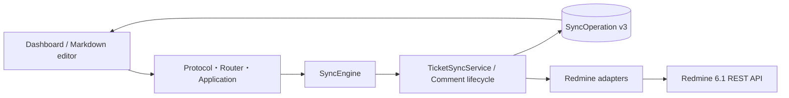
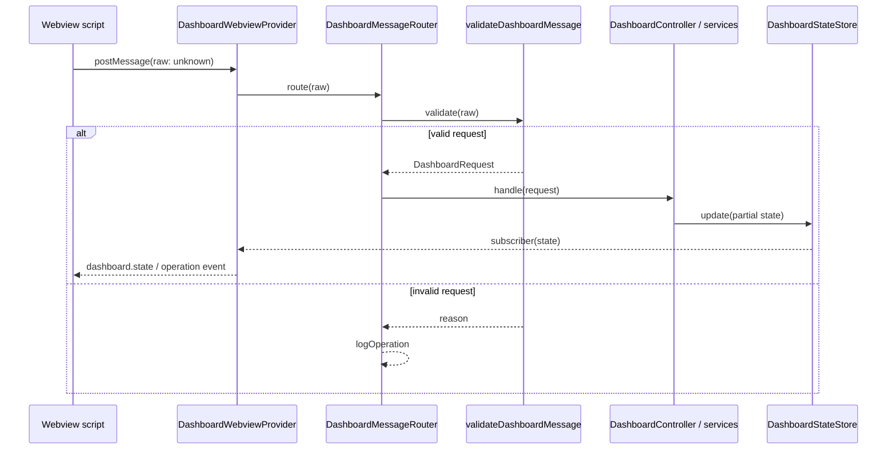
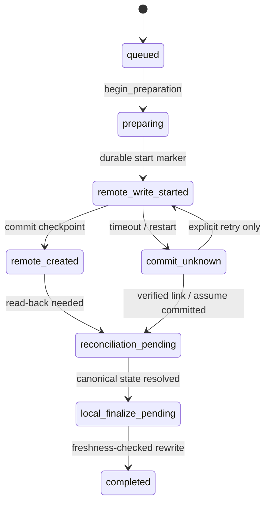

# Redmine Client プロジェクト理解資料

調査日: 2026-08-13  
対象: `redmine-client` 0.5.4  
図版: [アーキテクチャ概要](./architecture-overview-2026-08-13.html)

## 要約

- 目的: Redmine 6.1 のチケット、コメント、Markdown編集、オフライン同期を、VS Codeの単一Dashboard WebviewとMarkdown editorから扱う拡張機能である。
- 主な利用者: Redmineを日常的に使いながら、チケット本文やコメントをVS Code上のMarkdownとして編集したい開発者。
- 実行形態: Node.jsのVS Code Extension Hostで動作し、`src/extension.ts`をwebpackで`dist/extension.js`へbundleする。DashboardのHTML/CSS/JavaScriptもExtension Host側のTypeScriptから生成する。
- アーキテクチャ上の中心: `src/extension.ts`のcomposition root、Dashboardのmessage境界、`SyncEngine`、revision-awareな`TicketSyncService`、`workspaceState`に永続化される`SyncOperation`である。
- 調査確度: 高。README、manifest、主要entry point、CodeGraphの構造索引（617 files / 40,046 symbols）、同期設計判断、テスト群を相互参照した。実Redmine 6.1へのE2Eだけは本調査では実施していない。

## 最初に押さえる設計原則

1. **UIは1つ、入力経路は複数**: Activity BarのDashboardとMarkdown editorの保存・commandが、同じapplication/sync境界へ合流する。
2. **Webview入力は信用しない**: `unknown`として受け取り、protocol validatorを通過した`DashboardRequest`だけをcontrollerへ渡す（`src/dashboard/DashboardWebviewProvider.ts:74`、`src/dashboard/DashboardMessageRouter.ts:9`、`src/dashboard/dashboardMessageValidation.ts:106`）。
3. **remote writeより先にdurable checkpoint**: ticket/commentの書込みはoperation、revision、phase、effect ledgerを永続化してからRedmineへ送る。
4. **不明な書込み結果は自動再送しない**: `remote_write_started`や`commit_unknown`は明示的なreconcile/recovery対象となり、重複チケット・コメントを防ぐ（`src/app/syncEngine.ts:214`、`src/app/ticketSync/ticketSyncService.ts:738`）。
5. **接続先をoperationに固定する**: normalized base URLを`connectionScope`として持ち、別Redmineのqueueやdraftを混在させない（`src/config/connectionScope.ts:8`、`src/views/offlineSyncStore.ts:898`）。
6. **local finalizeにもfreshness fenceを使う**: remote commit後であっても、対象documentが閉じている、または新しい編集へ進んでいる場合は上書きせず、pendingとして復旧可能な状態を保つ。

## 新規参画者向けクイックスタート

### 最初に読む順番

1. `README.md` — 製品機能、ユーザーワークフロー、設定。
2. `src/extension.ts` — store、view、sync、command、editor eventの組み立て。
3. `src/dashboard/DashboardWebviewProvider.ts` と `src/dashboard/DashboardController.ts` — Dashboardの入出力とuse case委譲。
4. `src/app/syncEngine.ts` — ticket/commentを統合する同期入口。
5. `src/app/ticketSync/ticketSyncService.ts` — ticket create/updateの耐障害ライフサイクル。
6. `src/views/offlineSyncStore.ts` — 永続queue、migration、revision/effect ledger。
7. `src/redmine/client.ts` と `src/redmine/issues.ts` — HTTP、認証、Redmine DTO mapping。

### ローカル実行と検証

```bash
pnpm install
pnpm run compile
pnpm run compile-tests
pnpm run lint
pnpm test
```

VS CodeでF5を押すと`.vscode/launch.json`の`Run Extension`がExtension Development Hostを開く。`pnpm test`がElectron/Chromium sandboxで起動できない環境に限り、`pnpm run test:unsafe`を使う（`package.json:308`）。

## 技術スタック

| 領域 | 技術 | 根拠 |
|---|---|---|
| Runtime | VS Code Extension Host / Node.js、VS Code `^1.107.0` | `package.json:15`、`webpack.config.js` |
| 言語 | TypeScript 5.9、`strict: true`、ES2022 | `package.json:335`、`tsconfig.json` |
| UI | VS Code WebviewView、生成HTML/CSS/JavaScript、Markdown editor | `src/dashboard/DashboardWebviewProvider.ts:15` |
| Build | pnpm、webpack 5、ts-loader | `package.json:308`、`package.json:337` |
| Test | Mocha、`@vscode/test-cli`、`@vscode/test-electron` | `package.json:327`、`package.json:330` |
| 永続化 | `workspaceState`、`globalState`、`SecretStorage` | `src/extension.ts:29`、`src/extension.ts:34`、`src/extension.ts:36` |
| 外部連携 | Redmine 6.1 REST API over HTTP/HTTPS | `src/redmine/client.ts:90`、`src/redmine/issues.ts:60` |
| Localization | `vscode.l10n.t`、`l10n/`、`package.nls*.json` | `package.json:22`、`src/extension.ts:40` |

## リポジトリ構造

| Path | 責務 |
|---|---|
| `src/extension.ts` | composition root。store初期化、view、sync controller、editor event、command、設定変更を配線する。 |
| `src/app/` | application層。command/view登録、保存分類、通知、同期orchestrationを担当する。 |
| `src/app/ticketSync/` | ticket同期のport、operation reducer、service、reconcile、remote commit後のfinalizeを所有する。 |
| `src/dashboard/` | Webview protocol、validation、router、controller、state store、service、view model、HTML/CSS/scriptを所有する。 |
| `src/commands/` | Command PaletteやDashboardから呼ばれる薄いhandler。共有同期ロジックは`app`へ委譲する。 |
| `src/views/` | editor registry、Markdown変換、draft、offline queue、競合解決、UI向けadapterを担当する。 |
| `src/views/ticketSync/` | editor/queue表現をapplication ticket syncへ接続するadapter群。 |
| `src/redmine/` | HTTP clientとprojects/issues/comments/users/attachmentsのAPI・DTO mapping。 |
| `src/config/` | VS Code setting、接続scope、project選択、API key保管。 |
| `src/utils/` | URL、通知、画像、Mermaid変換、three-way merge、loggingなどの横断helper。 |
| `src/test/` | Extension Host中心のテスト。調査時点でtop-level `*.test.ts`は136本。 |
| `l10n/`, `package.nls*.json` | runtime/manifestのlocalization資産。 |
| `dist/`, `out/` | webpack bundleとtest compileの生成物。直接編集しない。 |

## アーキテクチャ概要

全体図は [architecture-overview-2026-08-13.html](./architecture-overview-2026-08-13.html) を参照する。依存方向は概ね次のとおりである。



### Runtime composition

`activate()`は現在のbase URLをconnection scopeへ正規化し、draft store、new-ticket draft store、offline sync store、ticket-list settings、SecretStorageを初期化する。その後、view、notification controller、sync controller、editor event、commandを順に登録する（`src/extension.ts:26-83`）。

base URL変更時はoffline storeとeditorのscopeを切り替え、draft storeを再初期化し、Dashboard stateをresetして再loadする（`src/extension.ts:88-102`）。この処理が接続先をまたぐstate混入を防ぐruntime側の防波堤である。

### Dashboard boundary

`DashboardWebviewProvider`は`DashboardStateStore`、`DashboardController`、`DashboardMessageRouter`を所有し、store更新を`dashboard.state` eventとしてvisibleなWebviewへ送る（`src/dashboard/DashboardWebviewProvider.ts:20-53`）。非表示中は`latestState`だけを保持し、再表示時に再送する（同:81-96）。

Webview messageは必ず次の順で流れる。



`DashboardController`自身はorchestratorであり、project、ticket、comment、unsynced、metadata、composerの各serviceへ処理を分配する。UI要件を追加する場合、protocol unionとvalidator、router/controller、state/view model、Webview scriptを一つの変更単位として確認する。

### Application and presentation ports

`src/app/viewRegistry.ts`がDashboard providerを登録し、ticket/comment/unsynced/settings向けのpresentation portを構成する。`src/app/commandRegistry.ts`は多数のcommandを登録するが、同期の実処理は`syncController`と共通serviceへ委譲する。これにより、Command Palette、editor save、Dashboard actionが同じ同期結果mappingと通知更新を再利用する。

## 主なワークフロー

### 1. Dashboardのticket読込み

- Entry: `DashboardController.initialize()`または`dashboard.ready` / `tickets.refresh` request。
- Flow: Webview message validation → controller → `DashboardTicketService` → `redmine/issues.ts` → `requestJson()` → state store update → `dashboard.state` event。
- Readとwriteの違い: ticket一覧・詳細などのreadはDashboard serviceからRedmine adapterへ直接到達できる。mutationはsync lifecycleを迂回してはならない。
- 重要な防御: connection changeのgeneration値で古い非同期responseを捨て、切替後stateへの混入を防ぐ。

### 2. Markdown editorの保存

- Entry: `registerEditorEvents()`がdocument saveを捕捉し、`syncController`へ委譲する（`src/extension.ts:72-83`）。
- Auto mode: editor内容をまずqueue/journalへ保存し、そのoperationを同期する。
- Manual mode: queueへ保存して停止し、DashboardのUnsyncedタブまたはcommandから後で同期する。
- Image: Markdownのlocal imageをupload tokenへ変換した後、ticket/comment payloadへ含める。
- Conflict: remote更新時刻などから競合を検出し、local/remote priorityまたは行単位three-way mergeへ進む。merge結果は自動送信せず、ユーザーの確認・保存を待つ。

### 3. Sync One / Sync All

`SyncEngine.syncOne()`はticket/newTicketを`TicketSyncService.syncQueueItem()`へ、commentを共通comment lifecycleへ振り分ける（`src/app/syncEngine.ts:170-193`）。同じ`connectionScope + operation identity`の並行実行は同じPromiseへ集約され、同一writeの重複実行を抑える。

`syncAll()`は開始時のplan、個々のresult、cancel時のremainingを明示的に保持する。cancelは未処理項目をqueueへ残す。

### 4. Ticket create/update lifecycle



`TicketSyncService`は`SyncJournal`、`DocumentPort`、create/update adapter、finalizer、reconcilerを依存として持つ（`src/app/ticketSync/ticketSyncService.ts:169-205`）。新規ticketはoperationをjournalへ保存してから`createOrResume()`へ進む（同:207-229）。remote commit後はread-backしたcanonical stateを得て、documentのexpected revision/contentが一致する場合だけlocal rewriteを行う。

### 5. 永続queueと再起動復元

`SyncOperation`は`operationId`、`kind`、`connectionScope`、`revision`、`phase`、`effects`、domain payloadを持つ（`src/views/offlineSyncStore.ts:105-121`）。保存形式v3では`operations`配列がsource of truthであり、旧`tickets/comments/newTickets`はread compatibility用である（同:242-249、537-543）。

scopeごとのMemento更新はPromise chainで直列化され、書込み完了順の逆転によるrestart state巻戻しを防ぐ（同:545-576）。初期化時はscoped v3、scoped legacy、global legacyの順に読込み、必要ならv3へmigrationする（同:868-895）。

`revision`がactive write snapshotを固定し、同期中の追加保存は`nextIntent`へcoalesceされる。effect ledgerはticket/comment create/update、child create、compensation、local finalizationなどを個別にcheckpointする。

## データと状態の所有権

| データ | 所有 / 保存先 | ライフタイム | 注意点 |
|---|---|---|---|
| Dashboard表示state | `DashboardStateStore` | Extension Host process | 非表示Webviewには`latestState`を再送する。 |
| Offline sync operation | `workspaceState` / `offlineSyncStore` | workspace・再起動をまたぐ | v3、connection scoped、revision/effect ledger付き。 |
| Ticket/comment draft | `globalState`経由のdraft storage | 再起動をまたぐ | connection scopeを分離する。 |
| Editor binding | `ticketEditorRegistry` | process + open documents | legacy fileは明示的scope割当が必要。 |
| API key | `SecretStorage` | VS Code secret store | setting、log、fixtureへ実値を出さない。 |
| base URL / sync mode等 | VS Code configuration | user/workspace setting | base URL変更はstate resetを伴う。 |
| Remote canonical state | Redmine 6.1 | 外部system | local finalize前にread-back/reconcileする。 |

## Redmine integration

`src/redmine/client.ts`はNodeの`http`/`https`を直接使い、JSON/text request、timeout、status code、JSON parse errorを共通化する。API keyは`X-Redmine-API-Key` headerへ付与される（`src/redmine/client.ts:83-87`）。`runWithConnectionScope()`は`AsyncLocalStorage`へbase URLと開始時API key snapshotを保持し、複数requestの途中で設定が変わってもoperation内で混在させない（同:16-27）。

domain adapterは`projects.ts`、`issues.ts`、`comments.ts`、`users.ts`、`attachments.ts`に分かれる。たとえば`listIssues()`はRedmine responseをUI/domain向け`Ticket`へmappingし、`createIssue()`は`POST /issues.json`を発行する（`src/redmine/issues.ts:60-96`、同:140-147）。

## 設定・security・運用

- `baseUrl`: Redmine接続先。HTTP/HTTPS以外は拒否し、path末尾を正規化する（`src/redmine/client.ts:38-56`）。
- `requestTimeoutMs`: default 30秒（`package.json:290-293`）。
- `offlineSyncMode`: `auto`または`manual`（`package.json:281-288`）。
- `ignoreSSLErrors`: 開発・検証専用。trueの場合はactivation時と設定変更時に警告する（`src/extension.ts:39-41`、同:108-111）。
- API key: `redmine-client.apiKey`としてSecretStorageにだけ保存し、memory cacheはSecretStorage change eventで更新する（`src/config/apiKeyStore.ts:3-25`）。
- Logging: `Redmine Client` OutputChannelへoperation type、issue/project/draft ID、status、error type等を1行で出す（`src/utils/redmineLogger.ts:16-38`）。API keyやrequest bodyはlog schemaに含めない。
- Packaging: `pnpm run package`がproduction mode + hidden source mapでwebpack bundleを生成する（`package.json:308-318`）。

## テスト戦略

- `src/test/`にtop-level `*.test.ts`が136本あり、Extension Hostのproduction entry pointを通す回帰テストが中心である。
- Dashboard: message validation、routing、state restore、connection reset、project resolution、view model、settingsを個別に検証する。
- Sync: ticket create/update、comment create/update、partial failure、restart restore、revision mismatch、commit unknown、durable effect、entry-point parityを検証する。
- Persistence: offline store migration、connection scope、draft persistence、queue discard/force syncを検証する。
- Editor: registry、filename/frontmatter、content rewrite、save notification、conflict/mergeを検証する。
- 最低限の変更検証は`pnpm run compile-tests`と`pnpm run lint`。release相当は`pnpm test`。

本ドキュメント作成ではコードを変更していないため、compile/test suiteは実行せず、Markdown/HTMLの静的検査とdiagram self-checkを実行する。

## 変更時に壊しやすい不変条件

| 不変条件 | 破ると起きること | 主な確認先 |
|---|---|---|
| Webview requestをvalidator経由にする | 任意URI、範囲外値、不正なcommand payloadがcontrollerへ入る | `dashboardMessageValidation.test.ts` |
| remote write前のstarted checkpoint | crash/timeout後の自動再送で重複ticket/commentが生じる | `durableSyncEffect.test.ts`, `syncLifecycleBoundary.test.ts` |
| operation/revision/phaseのCAS | 古い同期結果が新しい編集やqueue状態へ適用される | `ticketSyncService.test.ts`, `ticketIntentRebase.test.ts` |
| connection scopeの固定 | 別Redmineへdraft、API key、queue itemを誤送信する | `connectionScope.test.ts`, `connectionContext.test.ts` |
| canonical read-back後のlocal finalize | server正規化値とlocal editorが乖離する | `syncNewTicketDraft.test.ts`, `commentCreatedUnresolved.test.ts` |
| source freshness確認 | 同期中に行われた新しい編集を上書きする | `editorContentApply.test.ts`, `durableSyncEffect.test.ts` |
| phase-aware discard | remote checkpointを失い、次回に同じPOSTを再実行する | `offlineSyncStore.test.ts` |
| legacy reader / v3 writer互換 | upgrade後に既存unsynced dataが消える | `offlineSyncStore.test.ts` |

## リスク、ギャップ、未確認事項

| 項目 | 根拠 | Follow-up |
|---|---|---|
| 実Redmine 6.1の耐障害E2E | 既存判断ログでも外部環境待ちと記録されている | test serverでtimeout、lost response、restart、reconcileを通す。 |
| `offlineSyncStore.ts`の責務集中 | schema、migration、normalization、reducer、persistence、compat APIを1ファイルで所有 | schema/reducer/persistence境界を保った段階的分割を検討。ただしstorage互換とCASを先にtestで固定する。 |
| Dashboard controller/serviceの変更波及 | protocol、validation、state、service、scriptが協調している | request/event追加時のchecklistまたは型駆動testを維持する。 |
| コメントとticketのlifecycle実装差 | `SyncEngine`で統合されるがticketは専用service、commentはengine内adapter hooksが中心 | 失敗semanticを揃える必要が出た場合のみ共通state machineを検討する。 |
| OutputChannel中心のobservability | local debuggingには有効だが集約telemetryはない | 運用要件が生じた時点で、secret/bodyを除外した相関ID設計を追加する。 |
| 大きな本文のthree-way merge | 100万LCS cell超は本文全体を競合扱いする設計判断 | 実利用データで閾値とUXを計測する。 |

## 変更箇所の選び方

- Dashboardへ表示項目を足す: `dashboardProtocol.ts` → validator → state/view model → service/controller → Webview script/style → tests。
- 新しいRedmine read APIを足す: `src/redmine/` adapter → Dashboard/application service → presentation state → tests。
- 新しいremote mutationを足す: 先に`SyncOperation`/effect/recovery semanticを設計し、`SyncEngine`または`TicketSyncService`のlifecycle owner経由にする。
- editor formatを変える: parser/template、registry、draft migration、local finalizer、conflict merge、legacy fixtureを一緒に確認する。
- persisted queueを変える: versioned reader、normalization、writer、scope key、restart restore、old fixtureを一つの変更単位にする。
- commandを足す: `package.json` contribution、`commandIds.ts`、`commandRegistry.ts`、localization、production entry testを確認する。

## 調査方法と根拠

- CodeGraphのAST索引で`activate`、Dashboard controller/router、`SyncEngine`、`TicketSyncService`、`SyncOperation`のdefinitionとcall relationshipを調査した。
- `README.md`、`package.json`、`webpack.config.js`、`tsconfig.json`、`AGENTS.md`を確認した。
- `docs/implementation-decisions/`の接続scope、revision lifecycle、sync engine統合、durable effects、three-way mergeに関する記録を確認した。
- line referenceは2026-08-13時点のworking treeを基準とする。既存working treeには本調査以前からの変更があるため、将来の編集で行番号は移動し得る。

