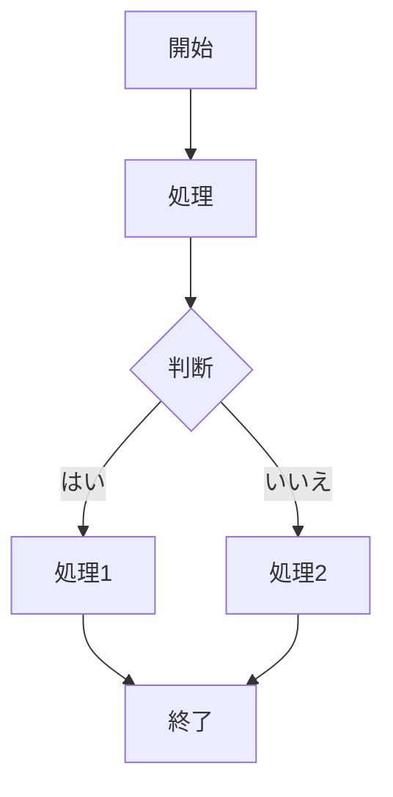

# Project Constitution: VSCode Extension Development

## 1. 開発プロセス (Process)
- **テスト駆動開発 (TDD)**: 
    - 実装コードを書く前に必ずテスト（Unit Test）を記述し、Red（失敗）を確認すること。
    - 各タスクの完了条件に「テストのパス」を含めること。

## 2. 技術スタックとコーディング規約 (Technical Standards)
- **言語**: TypeScript (Strict Mode必須)
- **設計原則**: 
    - **DRY (Don't Repeat Yourself)**: 同一のロジックが2箇所以上で発生する場合は共通化する。
    - **Clean Code**: 1関数1責任を徹底し、関数の長さは原則として25行以内とする。
- **VSCode API 利用基準**: 
    - ユーザー体験を損なわないよう、重い処理は `vscode.window.withProgress` を利用し非同期で実行する。
    - 拡張機能のライフサイクル（deactivate）を適切に管理し、リソースリークを防ぐ。

## 3. 実装の定義 (Definition of Done)
- リンター（ESLint）およびフォーマッター（Prettier）のエラーがないこと。

-----
# 仕様
RedmineのREST APIと通信して指定したプロジェクトに対してチケット登録・編集・削除を行う。
指定したプロジェクトに子プロジェクトがある場合はチケット操作対象にできる。
プロジェクトのチケット一覧はリストでエクスプローラー欄に表示する。
エクスプローラーではチケットのフィルタができる。
チケット一覧から選択したチケットの内容がエディタにプレビュー表示される。
既に投稿済のコメントもプレビューから選択して編集可能である。
RedmineのREST APIの仕様は以下のURLを参照する。
Redmineのバージョンは6.1.0を想定する。
VSCodeのエディタに記入した内容をチケットの説明文として登録する。
VSCodeで書いた内容をチケットとして登録することでRedmineへのチケット登録を迅速に行い、履歴も残すようにする。添付している画像もチケットの添付ファイルとして登録する。
チケット登録の際はmermaidはredmica_ui_extensionの記述に変換する。たとえば以下のようになる。



{{mermaid
graph TD;
    A[開始] --> B[処理];
    B --> C{判断};
    C -- はい --> D[処理1];
    C -- いいえ --> E[処理2];
    D --> F[終了];
    E --> F;
}}


---

# Specification: Redmine Integration for VSCode

## 1. 概要 (Background & Goal)
Redmine（Ver 6.1.0）との連携により、VSCode上でチケット管理を完結させる。特に、エディタを活用した迅速なチケット作成と、画像添付、および特定のRedmine拡張（redmica_ui_extension）に対応したMermaid変換をサポートする。

## 2. ユーザーストーリー (User Stories)
- 開発者は、エディタで書いた内容を即座にRedmineチケットとして投稿し、開発フローを中断せずに履歴を残したい。
- 開発者は、既存チケットのコメントをVSCodeエディタ上で直接編集したい。
- 開発者は、ドキュメント内のMermaid図を、Redmine上で正しくレンダリングされる形式で投稿したい。

## 3. 機能要件 (Functional Requirements)
### 3.1 エクスプローラー表示とフィルタ
- VSCodeのサイドバー（エクスプローラー）にプロジェクトごとのチケット一覧を表示する。
- 親プロジェクトを選択した際、子プロジェクトのチケットも操作対象として含めることができる。
- チケット一覧に対して、ステータスや担当者による動的なフィルタリング機能を提供する。

### 3.2 チケットのプレビューと編集
- 一覧からチケットを選択すると、エディタ領域に読み取り専用のプレビューを表示する。
- チケットに紐づく「既存のコメント」をリスト表示し、選択したコメントを編集・保存できる。

### 3.3 チケット作成・更新ロジック
- アクティブなエディタの内容を「説明文」としてチケットを新規登録する。
- **画像添付**: エディタに関連付けられた、あるいは指定された画像ファイルを、Redmineの添付ファイルAPIを通じてアップロードし、チケットに関連付ける。
- **Mermaid変換**: 投稿時、Markdown内の ```mermaid ... ``` ブロックを、redmica_ui_extension形式の `{{mermaid ... }}` に置換して送信する。

## 4. 受け入れ条件 (Acceptance Criteria)
- [ ] サイドバーにRedmineのチケット一覧が正常にロードされること。
- [ ] 子プロジェクトを含むチケットが一覧に表示・操作可能であること。
- [ ] チケット選択時、エディタに内容が表示されること。
- [ ] エディタ上の画像データがRedmineの添付ファイルとして登録されること。
- [ ] 投稿されたチケットの説明文内で、Mermaid図が `{{mermaid}}` 形式に変換されていること。
- [ ] 既存のコメントを選択し、修正内容がRedmine側に反映されること。

## 5. ビジネスロジック / 変換ルール
- **API Version**: Redmine REST API v6.1.0 準拠。
- **変換ルール**:
    - 入力: ` ```mermaid\n(content)\n``` `
    - 出力: `{{mermaid\n(content)\n}}`